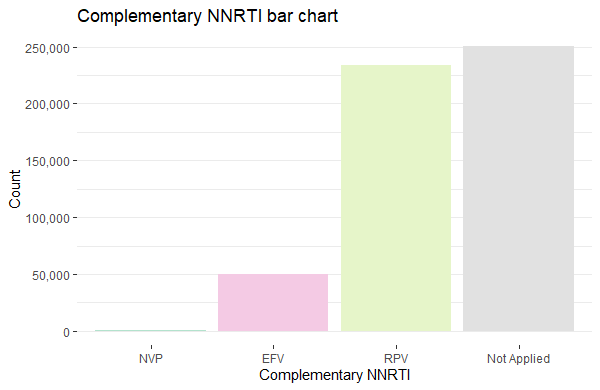

```{r setup, include=FALSE}
library(tidyverse)
library(plotly)
```

## Original context
This function was made for use in exploratory data analysis of a heart failure dataset. 

## On to the function!

```{r}
ggbar <- function(xvalue) {
  
  xvar_name <- deparse(substitute(xvalue))
  xvar_spaces <- gsub("_", " ", xvar_name)
  # I am using regex to convert the first letter from lowercase to uppercase  
  # instead of using a prebuilt function because I want to avoid changing
  # acronyms in capital letters to sentence or title case
  xlab_title <- sub("\\b([a-z])", 
                    "\\U\\1", 
                    (gsub("_", " ", xvar_spaces)),
                    perl=TRUE)
  
  p <- df %>%
    ggplot(aes(x = {{xvalue}}, fill = {{xvalue}})) +
    labs(x = xlab_title, y = "Count", 
         title = paste("Bar chart of", gsub("_", " ", xvar_spaces))) +
    geom_bar() +
    theme(panel.grid.major.x = element_blank()) +
    scale_fill_viridis_d()
  
  ggplotly(p) %>%
  hide_legend()
  
}
```

## Example using Iris
Iris is convenient as an inbuilt dataset but this is pretty boring.... 
It also doesn't demonstrate the work I did to automatically make the x-axis title nicer. Nonetheless you can see that it is less boring than the standard.

```{r, preview=TRUE}
df <- iris

ggbar(Species)
```

## Without using the function

We can see here that the out of the box bar chart is boring grey, has vertical gridlines in the background (unecessary ink distracting from data in a bar chart) and has a sad y-axis label we would manually change. On a different dataset, we might appreciate more that the use of `Plotly` in  ggbar() allows us to zoom in and pan on the figure without reaching for Shiny. We might also value setting the dataframe inside the function (I don't normally assign to df!) so we aren't retyping the dataframe each time we make a plot of a categorical variable.

```{r}
ggplot(iris, aes(x = Species)) +
  geom_bar()
```

## What was I doing before?

Here is an example of a bar chart I made for EDA of a synthetic HIV dataset.

```{r, eval=F}
art_hiv %>%
  ggplot(aes(x = reorder(Comp_INI, Comp_INI, length), fill = Comp_INI)) +
  geom_bar() +
  scale_y_continuous(labels = scales::label_comma()) +
  scale_fill_manual(values = c("#b3e2cd", "#f4cae4", "#e6f5c9", "#E1E1E1")) +
  ggtitle( "Complementary integrase inhibitor bar chart") +
  xlab("Complementary integrase inhibitor") +
  ylab("Count") +
  theme_bw() +
  theme(panel.border = element_blank(),
        panel.grid.major.x = element_blank(),
        legend.position = "None")
```


It is pretty but it was also a lot of repetition to produce a bunch of similar charts.


```{r, echo = FALSE, fig.align = 'center', results = 'markup'}

```

More examples can be seen at [Exploring synthetic HIV data](https://brianna-argall.github.io/blog/posts/2024-08-27-exploring-synthetic-hiv-data/)

For the specific case of binary variables I had:

```{r, eval=F}
binary_figure <- function(xvalue) {
  art_hiv %>%
    ggplot(aes(x = {{xvalue}}, fill = {{xvalue}})) +
    geom_bar() +
    scale_y_continuous(labels = scales::label_comma(),
                       name = "Count") +
    # I just think the only grey is boring & defaults were ugly (too saturated)
    # I also wanted to avoid red or green symbolism
    scale_fill_manual(values = c("#8dd3c7", "#bebada")) +
    theme_bw() +
    theme(panel.border = element_blank(),
          panel.grid.major.x = element_blank(),
          legend.position = "None") +
    stat_count(geom = "text", aes(label = after_stat(count)), vjust = -0.5)
}
```

## Comments

You'll notice these functions have a few differences, owing to differences in the datasets and the task. My ggbar() function was from a dataset that had a lot of variables and not as many rows, so handling the variable names was important and there was no need to display large counts nicely. binary_figure() doesn't provide any interactivity and the counts are labelled with the bars (yes I did also consider y axis transformation to make these easier to read). I loved my custom grey that matched the intensity of the colours perfectly for the other column. To achieve this I took the rgb values from my colours - which were selected from a colorbrewer palette - and found the hsv code corresponding to setting the red, green and blue content each to the average of those three components.